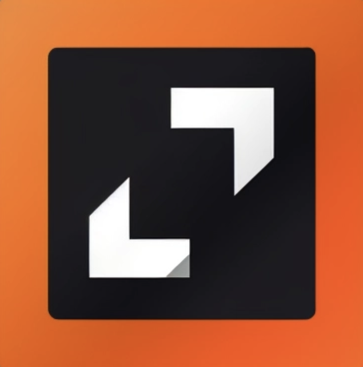
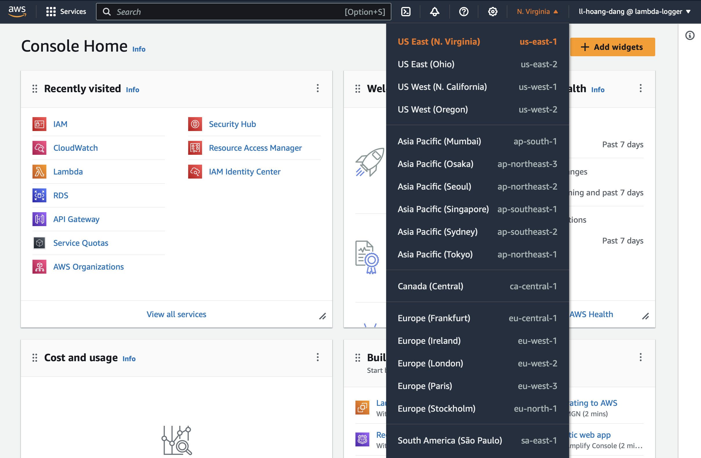
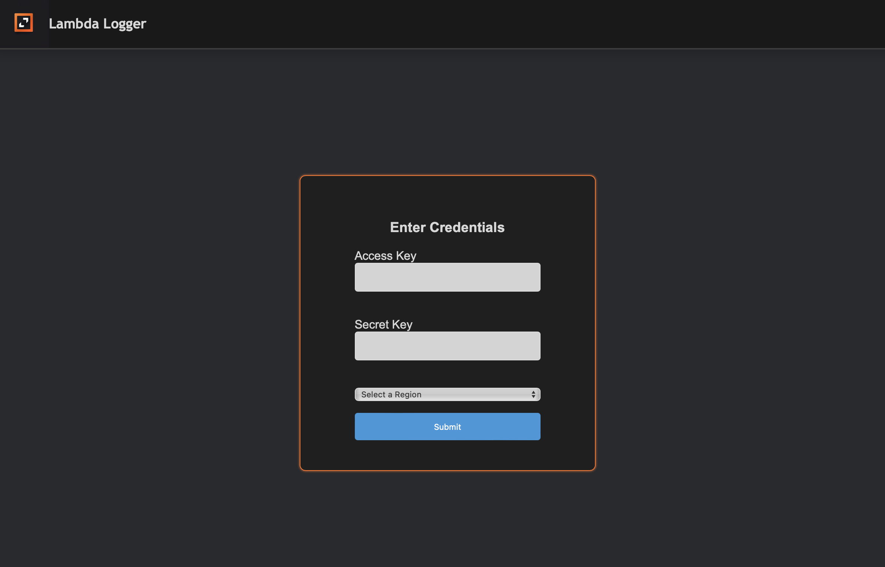
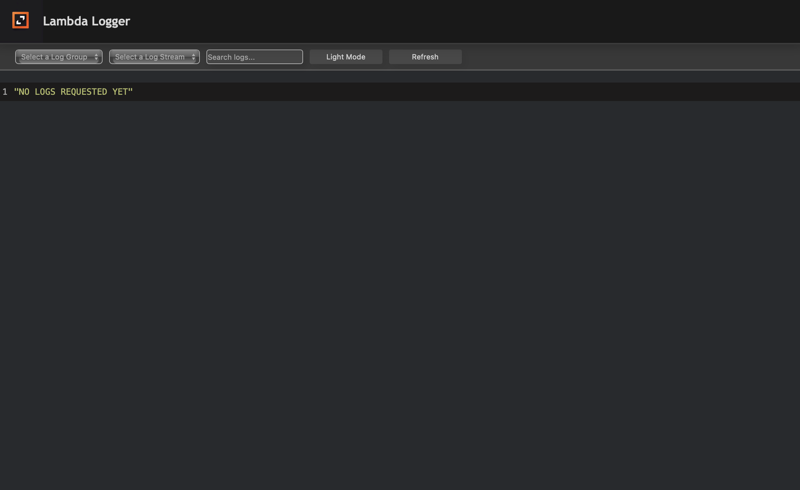
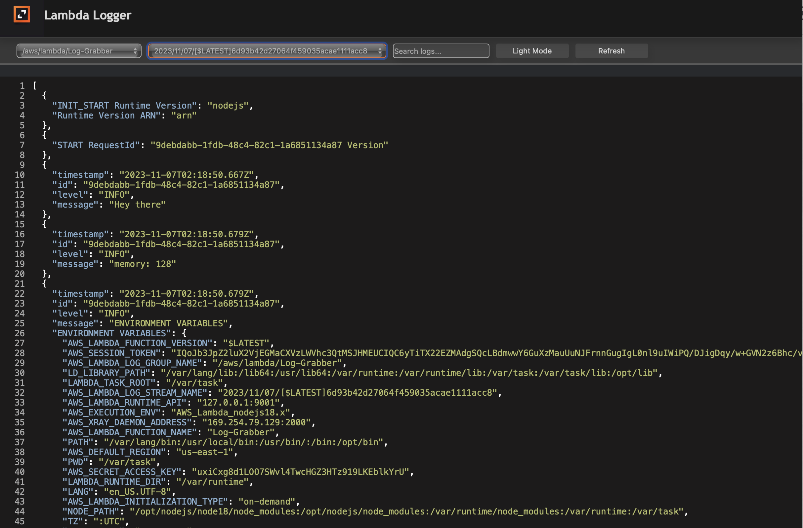

# Lambda-logger
Lambda Logger tackles post-deployment challenges by introducing an intuitive interface for swift log inspection. With JSON format logs and a custom parser for clarity, users gain accessible return values. Ensuring security, the application employs AWS IAM credentials for authentication, diminishing reliance on the sluggish AWS CloudWatch console.

  

## Table of Contents
1. [Features](#features)
2. [Getting Started Guide](#getting-started-guide)
3. [Documentation](#documentation)
4. [Contributing](#contributing)
5. [Contributors](#contributors)

## Features
- 
- 
- 

## Getting Started Guide
- From [Lambda-logger](https://github.com/oslabs-beta/lambda-logger), fork to your repo, then in the terminal, `git clone 'copied url'`
- How to get access-key and secret-key to log in?
    - From your AWS root account, you should have your own "IAM" user in your AWS account. If you do not have it yet, click [here](https://docs.aws.amazon.com/IAM/latest/UserGuide/id_users_create.html) to know how to create.
    - After got "IAM user", in your AWS Console, at search bar, search for `IAM`. Go to `Users` tab, then choose your <yourIAMuser> that you just create. In Summary, click `Create access key` --> choose `Local code` --> Check `I understand` box --> click `Next` --> In `Description tag value`, put any name you want to --> click `Create access key`

    - 

    - Now you should save `Secret access key` in somewhere(**Note:** this key are very sensitive, do NOT publish), or click on `Download .csv file` before click `Done`. If you forget this step, the "Secret key access" would be gone, unless you create a new one.

    - **Note:** You only can create up to 2 "Access key". If you want to create another one, you must delete the old one.
    - After get keys, get the region 
    

- Since we have all stuff to log in, on the terminal run `npm install`, then `npm run dev`, navigate to http://localhost:8080/ to view web application, and use both keys and region to access.
    

- Nav Bar Overview (Dropdowns, Search, Theme)

- Select Log group and Log Stream you want to access from your "Lambda function", then you will get content looks like this:

## Documentation
- How AWS SDK Is Implemented?
    - A software development kit (SDK) is a set of platform-specific building tools for developers. You require components like debuggers, compilers, and libraries to create code that runs on a specific platform, operating system, or programming language. SDKs put everything you need to develop and run software in one place. Additionally, they contain resources like documentation, tutorials, and guides as well as APIs and frameworks for faster application development.
    - We use The AWS SDK for JavaScript v3 API Reference Guide which provides a JavaScript API for AWS services. Particularly in this project, our team "AWS-SDK" to fetch data from CloudWatch.
    - For more info, click [here](https://docs.aws.amazon.com/sdk-for-javascript/v3/developer-guide/welcome.html).

- React Syntax Highlighter
    - Syntax highlighting component for `React`` using the seriously super amazing [lowlight](https://github.com/wooorm/lowlight) and [refractor](https://github.com/wooorm/refractor) by [wooorm](https://github.com/wooorm).
    - Click [here](https://www.npmjs.com/package/react-syntax-highlighter) for more information.

## Roadmap
| Feature                                          | Status |
| ------------------------------------------------ | ------ |
| Dynamiccally Fetch Logs and Stream From CloudWatch                                         | ✅     |
| Back-end Testing                                 | ✅     |
| Dark/Light Mode                                  | ✅     |
| Increase Testing Coverage                        | ⏳     |
| Make Stream Content linkable                      | ⚡️      |
| Adding more themes                                | ⚡️      |
| Improving search                               | ⚡️      |

- ✅ = Completed
- ⏳ = In-Progress
- ⚡️ = Backlog

## Contributing
- Potential iteration ideas
- What needs to be improved (code-wise)
    - Anything from the backlog
    - Add additional front end tests
    - Add additional back end tests
    - Migrate to AWS SDK 3

## Contributors

<table>
  <tr>
    <td align="center">
      
       
      <b>Conrad Preston</b>
       
      <a href="https://www.linkedin.com/in/conrad-preston-aaaa9b252/">🖇️</a>
      <a href="https://github.com/Conrady82">🐙</a>
    </td>
    <td align="center">
      
       
      <b>Hoang Dang</b>
       
      <a href="https://www.linkedin.com/in/hoang-dang-b884b4296/">🖇️</a>
      <a href="https://github.com/hoangdang91768">🐙</a>
    </td>
    <td align="center">
      
       
      <b>Luke Clarkson</b>
       
      <a href="https://www.linkedin.com/in/ljclarkson/">🖇️</a>
      <a href="https://github.com/LClarkson">🐙</a>
    </td>
    <td align="center">
      
       
      <b>Nick C. Mason</b>
       
      <a href="">🖇️</a>
      <a href="https://github.com/nickmasonswe">🐙</a>
    </td>
  </tr>
</table>

- 💻 = Website
- 🖇️ = LinkedIn
- 🐙 = Github